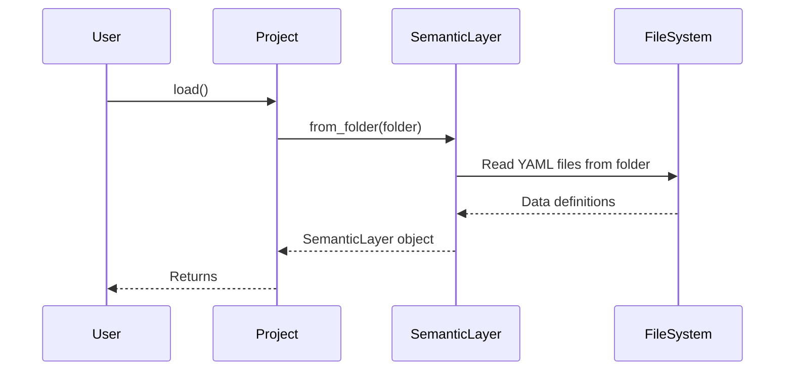

# Chapter 1: Project

Welcome to the first step in your journey with `allstars`! In this chapter, we'll explore the concept of a `Project`. Think of the `Project` as the central hub for your data definitions – it's like a well-organized folder that keeps everything related to your semantic layer in one place.

## Why do we need a Project?

Imagine you're building a house. You wouldn't just start laying bricks without a blueprint, right? The `Project` in `allstars` is like that blueprint. It helps you define your data landscape in a structured way.

Let's say you want to define how your customer data (like name, location, and purchase history) is related to your sales data (like order IDs and amounts). The `Project` helps you manage all those definitions neatly.  It loads all your data descriptions (like how different tables in your database connect with each other, and what each column means) from files, lets you work with them, and then saves them back when you're done. It also makes sure you can talk to your database correctly.

## Key Concepts

Here's a breakdown of the core ideas behind the `Project`:

*   **Container:**  The `Project` acts as a container. It holds all the definitions related to your data. This includes things like [Metrics](03_metric_.md) (calculations you want to perform, like "Total Sales"), [Dimensions](04_dimension_.md) (attributes you want to analyze, like "Customer Location"), and [Relations](05_relation_.md) (how your data tables connect).
*   **Loading and Saving:** The `Project` can load these definitions from files (usually YAML files) and save them back to disk. This allows you to define your data model in code and easily share it with others.
*   **Database Connection:**  The `Project` also manages the connection to your database. This allows `allstars` to query your data based on the definitions you've provided.

## Using the Project

Let's see how we can use the `Project` in action.

First, let's assume you have a folder (let's call it `my_project`) that contains YAML files describing your data model.  For example, you might have a `relations.yaml` file that defines how your `customers` table is related to your `orders` table.

Here's how you can load that project:

```python
from allstars.core.project import Project

# Create a Project instance
project = Project(folder="my_project")

# Load the semantic layer from the folder
project.load()

# Now you can access the semantic layer and work with your data definitions
semantic_layer = project.semantic_layer
print(semantic_layer) # This will print the semantic layer.
```

Explanation:

1.  We import the `Project` class.
2.  We create a `Project` object, telling it to look in the `my_project` folder for its data definitions.
3.  We call the `load()` method to load the data definitions from the files in that folder.  This populates the `semantic_layer` attribute of the `project` object. If no folder is specified, `allstars` defaults to the `ALLSTARS_FOLDER` specified in `config.py`.

Now, let's say you've made some changes to your data definitions and want to save them back to disk:

```python
from allstars.core.project import Project

# Assuming you've already loaded and modified the project...

# Save the changes back to the folder
project.flush()

#The content of my_project folder will be updated to reflect changes.
```

Explanation:

1.  We call the `flush()` method.
2.  This writes the current state of the semantic layer back to the files in the `my_project` folder.

## Under the Hood

Let's take a peek under the hood to see what happens when you call the `load()` and `flush()` methods.

Here's a simplified sequence diagram illustrating the `load()` process:



Explanation:

1.  The `User` calls the `load()` method on the `Project`.
2.  The `Project` then calls the `from_folder()` method on the `SemanticLayer`, passing in the folder path.
3.  The `SemanticLayer` reads the YAML files from the specified folder.
4.  The `FileSystem` returns the data definitions to the `SemanticLayer`.
5.  The `SemanticLayer` creates a SemanticLayer object based on the data definitions.
6.  The `Project` returns the created `SemanticLayer` object.

And here's a snippet from `allstars/core/project.py` showing the `load` method:

```python
from allstars.core.semantic_layer import SemanticLayer


class Project:
    def load(self, database_schema=None):
        if database_schema:
            # Load from database schema
            self.semantic_layer = SemanticLayer()
            self.semantic_layer.load_relations_from_schema(database_schema, self.db)
        else:
            # Load from files
            relation_folder = self.folder
            self.semantic_layer = SemanticLayer.from_folder(relation_folder)
```

Explanation:

This code shows that the `load()` method checks whether it needs to load a database schema or load the data from files. Based on the mode, different logic is executed. If a `database_schema` is provided, the data is loaded directly from the database. Otherwise, the data definitions are loaded from YAML files located in the specified folder.

## Conclusion

In this chapter, you learned about the `Project` and how it acts as a container for your semantic layer definitions. You saw how to load and save these definitions, and you got a glimpse of what happens under the hood. The `Project` is a crucial component for organizing and managing your data model in `allstars`.

Now that you understand the `Project`, let's move on to the next chapter and dive deeper into the [SemanticLayer](02_semanticlayer_.md) itself!


---

Generated by [AI Codebase Knowledge Builder](https://github.com/The-Pocket/Tutorial-Codebase-Knowledge)