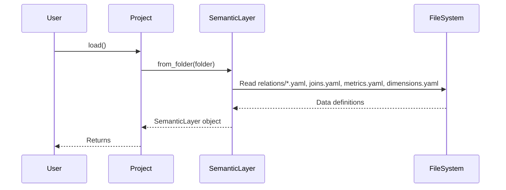

# Chapter 2: SemanticLayer

In the previous chapter, [Project](01_project_.md), we learned how to organize our data definitions in a central hub. Now, let's dive into the heart of `allstars`: the `SemanticLayer`.

Imagine you're a chef. You don't just throw raw ingredients into a pot and hope for the best, right? You have a recipe – a well-defined set of instructions that tells you exactly what ingredients to use, how to combine them, and what to expect as a result. The `SemanticLayer` is like that recipe for your data. It defines the ingredients (your data), how they connect, and what you want to measure.

## Why do we need a SemanticLayer?

Without a `SemanticLayer`, you'd have to write complex SQL queries every time you wanted to get insights from your data. This can be time-consuming, error-prone, and difficult to maintain.

Let's say you want to find the "Total Sales by Region". Without a `SemanticLayer`, you'd need to write a SQL query that joins your sales data with your customer data, groups the results by region, and calculates the sum of sales. This query could be quite complex, especially if your data is spread across multiple tables.

The `SemanticLayer` simplifies this process by providing a high-level interface to your data. Instead of writing raw SQL, you can interact with named objects like `Total Sales` and `Region`, and the `SemanticLayer` will translate your request into the appropriate SQL query. This makes it much easier to define and reuse business logic.

## Key Concepts

Here's a breakdown of the core ideas behind the `SemanticLayer`:

*   **Definitions Centralization:** The `SemanticLayer` is the single source of truth for your data definitions. It stores all the information about your [Relations](05_relation_.md), [Joins](06_join_.md), [Metrics](03_metric_.md), and [Dimensions](04_dimension_.md). Think of it as a dictionary that defines what each of those things *means* in your data world.
*   **Abstraction:** It hides the complexity of the underlying database. You don't need to know the specific SQL syntax or the physical structure of your database to work with your data. You interact with named objects that represent business concepts.
*   **Translation:** It translates your high-level requests into SQL queries that the database can understand. This allows you to focus on the business logic, without worrying about the technical details of querying the data.
*   **Reusability:** You define things *once*, and reuse them everywhere. If the underlying structure of your data changes, you only need to update the definitions in the `SemanticLayer`, and all your queries will automatically adapt.

## Using the SemanticLayer

Let's see how we can use the `SemanticLayer` to solve our "Total Sales by Region" use case. First, we need a [Project](01_project_.md) with some data defined.  Let's assume we have a `Project` loaded and its `semantic_layer` is accessible.

```python
from allstars.core.project import Project

# Load the project
project = Project(folder="my_project") # Replace with your actual folder
project.load()

# Access the semantic_layer
semantic_layer = project.semantic_layer

print(semantic_layer)
```

Explanation:

1.  We load our [Project](01_project_.md) from the `my_project` folder (or wherever your data definitions are stored).  Remember from [Chapter 1: Project](01_project_.md) this loads all your YAML definition files.
2.  We access the `semantic_layer` attribute of the `project` object. This gives us access to all the data definitions.
3.  Printing the `semantic_layer` is useful for debugging and quickly viewing the defined objects. It will print a representation of the `SemanticLayer` object, including its attributes like metrics, dimensions and relations.

Now, let's assume you want to retrieve the "Total Sales" metric:

```python
total_sales_metric = semantic_layer.metrics.get("total_sales")
print(total_sales_metric)
```

Explanation:

1.  We access the `metrics` attribute of the `semantic_layer`, which is a `SerializableCollection` of [Metric](03_metric_.md) objects.
2.  We use the `get` method to retrieve the metric with the key "total_sales".

Similarly, you can access dimensions:

```python
region_dimension = semantic_layer.dimensions.get("customer.region")
print(region_dimension)
```

Explanation:

1.  We access the `dimensions` attribute of the `semantic_layer`, which is a `SerializableCollection` of [Dimension](04_dimension_.md) objects.
2.  We use the `get` method to retrieve the dimension with the key "customer.region".

These individual components are combined to make queries using the other modules that will be discussed in later chapters.

## Under the Hood

Let's take a peek under the hood to see how the `SemanticLayer` is loaded from files.

Here's a simplified sequence diagram illustrating the process:



Explanation:

1.  The `User` calls the `load()` method on the `Project`.
2.  The `Project` then calls the `from_folder()` method on the `SemanticLayer`, passing in the folder path.
3.  The `SemanticLayer` reads YAML files from the specified subfolders and files.
4.  The `FileSystem` returns the data definitions to the `SemanticLayer`.
5.  The `SemanticLayer` creates a SemanticLayer object based on the data definitions.
6.  The `Project` returns the created `SemanticLayer` object.

And here's a snippet from `allstars/core/semantic_layer.py` showing the `from_folder` method:

```python
@classmethod
def from_folder(cls, folder_path=None):
    # Relations
    rel_folder = os.path.join(folder_path, "relations")
    yaml_files = glob.glob(f"{rel_folder}/*.yaml")
    relations = SerializableCollection()
    for file_path in yaml_files:
        relations.append(Relation.from_yaml_file(file_path))

    # Joins, Metrics, Dimensions (similar loading logic)
    ...

    return cls(
        relations=relations,
        joins=joins,
        dimensions=dimensions,
        metrics=metrics,
    )
```

Explanation:

This code shows how the `from_folder` method loads the data definitions from YAML files. It reads each file, parses the YAML content, and creates the corresponding objects (e.g., [Relation](05_relation_.md), [Join](06_join_.md), [Metric](03_metric_.md), [Dimension](04_dimension_.md)). These objects are then stored in the `SemanticLayer`. It uses the `SerializableCollection` to store and manage these objects.

## Conclusion

In this chapter, you learned about the `SemanticLayer` and how it acts as the central hub for your data definitions. You saw how to load it from a [Project](01_project_.md) and how to access the [Metrics](03_metric_.md) and [Dimensions](04_dimension_.md) defined within it.

Now that you understand the `SemanticLayer`, let's move on to the next chapter and dive deeper into [Metrics](03_metric_.md)!


---

Generated by [AI Codebase Knowledge Builder](https://github.com/The-Pocket/Tutorial-Codebase-Knowledge)