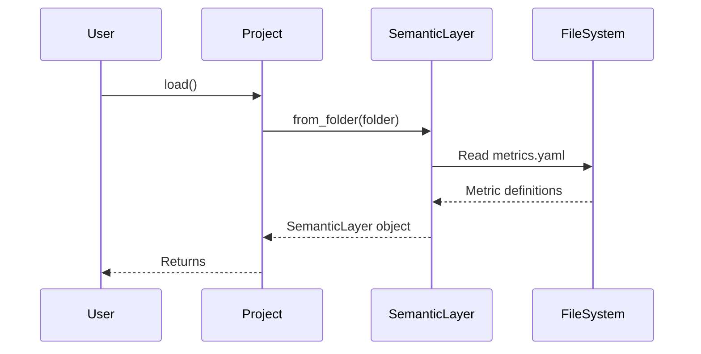

# Chapter 3: Metric

In the previous chapter, [SemanticLayer](02_semanticlayer_.md), we learned how to organize all our data definitions in a central place. Now, let's zoom in on one specific type of definition: the `Metric`.

Imagine you're running a lemonade stand. You probably want to track how much money you're making, right? That's your "Total Revenue". And maybe you also want to know how many cups of lemonade you're selling - that's your "Number of Cups Sold". These are *metrics* - key measurements that tell you how your business is doing.

In `allstars`, a `Metric` represents a calculation or measurement you want to track. It's like a pre-defined question you can ask of your data.

## Why do we need Metrics?

Instead of writing the SQL to calculate total revenue or number of customers every time you need it, you can define a `Metric` once with the SQL expression. The system then knows how to calculate this metric whenever you request it, ensuring consistency and saving you time.

Let's say you want to track "Total Sales". Without a `Metric`, you'd have to remember the exact SQL query to sum the sales figures every single time. With a `Metric`, you define it once, and then you can easily retrieve it whenever you need it.

## Key Concepts

Let's break down the core concept of a `Metric`:

*   **Name (Key):** This is the unique identifier for your `Metric`, like "Total Sales" or "Customer Count". It is the key by which you will find it in the [SemanticLayer](02_semanticlayer_.md).
*   **Expression:** This is the SQL expression that defines how to calculate the `Metric`, like "SUM(sales)" or "COUNT(DISTINCT customer_id)". This is the actual calculation that happens.
*   **Relation:** This specifies which table(s) the `Metric` should be calculated from. Think of it as saying, "Calculate this metric from *this* set of data".

## Using Metrics

Let's see how we can use a `Metric` in `allstars`. First, let's assume we have a [Project](01_project_.md) loaded and its `semantic_layer` is accessible, just like in the previous chapter:

```python
from allstars.core.project import Project

# Load the project
project = Project(folder="my_project") # Replace with your actual folder
project.load()

# Access the semantic_layer
semantic_layer = project.semantic_layer
```

Now, let's say we want to retrieve a metric named "total_sales":

```python
total_sales_metric = semantic_layer.metrics.get("total_sales")
print(total_sales_metric)
```

Explanation:

1.  We access the `metrics` attribute of the `semantic_layer`, which is a `SerializableCollection` of [Metric](03_metric_.md) objects.
2.  We use the `get` method to retrieve the metric with the key "total_sales".  The `get` method will return the `Metric` object if it exists, or `None` if it doesn't. The `print` statement will show you the details of the `Metric` object, including its key, expression, and relation.

Now, what if we want to see the expression associated with this `Metric`?

```python
if total_sales_metric: # Always check if the metric exists!
    print(total_sales_metric.expression)
else:
    print("Metric 'total_sales' not found.")
```

Explanation:

1. We check if `total_sales_metric` exists to avoid potential errors if the metric is not defined.
2. We access the `expression` attribute of the `total_sales_metric` object, which stores the SQL expression for the metric. The `print` statement will display the SQL expression, such as `SUM(sales)`.

## Under the Hood

Let's take a peek under the hood to see how the [SemanticLayer](02_semanticlayer_.md) loads [Metrics](03_metric_.md) from files.

Here's a simplified sequence diagram illustrating the process:



Explanation:

1.  The `User` calls the `load()` method on the `Project`.
2.  The `Project` then calls the `from_folder()` method on the `SemanticLayer`, passing in the folder path.
3.  The `SemanticLayer` reads the `metrics.yaml` file from the specified folder.
4.  The `FileSystem` returns the metric definitions to the `SemanticLayer`.
5.  The `SemanticLayer` creates a SemanticLayer object containing the loaded metrics.
6.  The `Project` returns the created `SemanticLayer` object.

And here's a snippet from `allstars/core/semantic_layer.py` showing how the `SemanticLayer` loads metrics:

```python
@classmethod
def from_folder(cls, folder_path=None):
    # ... (other loading logic) ...

    # Metrics
    f = os.path.join(folder_path, "metrics.yaml")
    metrics = SerializableCollection.from_yaml_file(f, Metric, key="metrics")

    # ... (other loading logic) ...

    return cls(
        # ... (other attributes) ...,
        metrics=metrics,
        # ... (other attributes) ...
    )
```

Explanation:

This code shows that the `from_folder` method reads the `metrics.yaml` file, uses `SerializableCollection.from_yaml_file` to parse it, and stores the resulting `Metric` objects in the `metrics` attribute of the `SemanticLayer`.

## Conclusion

In this chapter, you learned about `Metrics` and how they represent calculations or measurements you want to track. You saw how to retrieve `Metrics` from the [SemanticLayer](02_semanticlayer_.md) and access their expressions.

Now that you understand `Metrics`, let's move on to the next chapter and dive deeper into [Dimensions](04_dimension_.md)!


---

Generated by [AI Codebase Knowledge Builder](https://github.com/The-Pocket/Tutorial-Codebase-Knowledge)