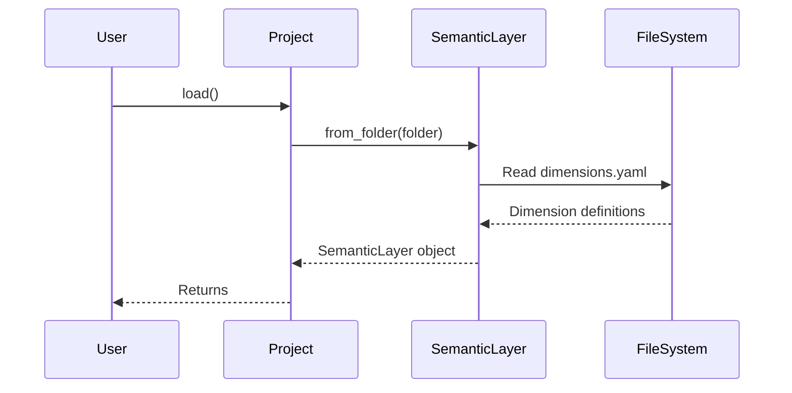

# Chapter 4: Dimension

In the previous chapter, [Metric](03_metric_.md), we learned how to define calculations we want to track in our data. Now, let's explore another crucial concept: the `Dimension`.

Imagine you're looking at a report of your total sales. Knowing the total is good, but what if you want to know *where* those sales are coming from? Or *what type* of products are selling best? That's where `Dimensions` come in!

A `Dimension` is an attribute or characteristic of your data that you use to group or filter your metrics, like "Region" or "Product Category".  Imagine them as lenses through which you view your metrics. Instead of specifying "WHERE region = 'North America'" in every query, you can define a Dimension "Region" and then easily analyze your "Total Sales" by "Region".

## Why do we need Dimensions?

Without `Dimensions`, you would need to write complex SQL queries every time you wanted to slice and dice your data.

Let's say you want to analyze "Total Sales" by "Region." You'd need to manually add `GROUP BY` clauses to your SQL queries. If you also want to analyze by "Product Category," you'd have to modify your query again. This is repetitive and error-prone.

`Dimensions` solve this problem by providing a standardized way to represent these attributes. You define a `Dimension` once, and then you can easily use it to analyze your metrics in different ways.

## Key Concepts

Let's break down the core concepts behind a `Dimension`:

*   **Name (Key):** This is the unique identifier for your `Dimension`, like "customer.region" or "product.category".  It's how you'll refer to it in your [SemanticLayer](02_semanticlayer_.md).
*   **Expression:** This is the SQL expression that represents the `Dimension`, like "customer.region" or "product.category". This is the actual column or calculation that represents the attribute.
*   **Relation:** This specifies which table(s) the `Dimension` comes from. This tells `allstars` where to find the data for the `Dimension`.

## Using Dimensions

Let's see how we can use a `Dimension` in `allstars`. As before, let's assume we have a [Project](01_project_.md) loaded and its `semantic_layer` is accessible:

```python
from allstars.core.project import Project

# Load the project
project = Project(folder="my_project") # Replace with your actual folder
project.load()

# Access the semantic_layer
semantic_layer = project.semantic_layer
```

Now, let's say we want to retrieve a dimension named "customer.region":

```python
region_dimension = semantic_layer.dimensions.get("customer.region")
print(region_dimension)
```

Explanation:

1.  We access the `dimensions` attribute of the `semantic_layer`, which is a `SerializableCollection` of [Dimension](04_dimension_.md) objects.
2.  We use the `get` method to retrieve the dimension with the key "customer.region". The print statement will show you the details of the Dimension object.

What if we want to see the expression associated with this `Dimension`?

```python
if region_dimension:  # Always check if the dimension exists!
    print(region_dimension.expression)
else:
    print("Dimension 'customer.region' not found.")
```

Explanation:

1.  We check if `region_dimension` exists to avoid potential errors.
2.  We access the `expression` attribute of the `region_dimension` object, which stores the SQL expression for the dimension. The `print` statement will display the SQL expression, such as `customer.region`.

## Under the Hood

Let's see how the [SemanticLayer](02_semanticlayer_.md) loads `Dimensions` from files.

Here's a simplified sequence diagram:



Explanation:

1.  The `User` calls the `load()` method on the `Project`.
2.  The `Project` calls the `from_folder()` method on the `SemanticLayer`.
3.  The `SemanticLayer` reads the `dimensions.yaml` file.
4.  The `FileSystem` returns the dimension definitions.
5.  The `SemanticLayer` creates a `SemanticLayer` object with the loaded dimensions.
6.  The `Project` returns the `SemanticLayer` object.

Here's a snippet from `allstars/core/semantic_layer.py` showing how `Dimensions` are loaded:

```python
@classmethod
def from_folder(cls, folder_path=None):
    # ... (other loading logic) ...

    # Dimensions
    f = os.path.join(folder_path, "dimensions.yaml")
    dimensions = SerializableCollection.from_yaml_file(
        f, Dimension, key="dimensions"
    )

    # ... (other loading logic) ...

    return cls(
        # ... (other attributes) ...,
        dimensions=dimensions,
        # ... (other attributes) ...
    )
```

Explanation:

This code shows that the `from_folder` method reads the `dimensions.yaml` file, uses `SerializableCollection.from_yaml_file` to parse it, and stores the resulting `Dimension` objects in the `dimensions` attribute of the `SemanticLayer`.

## Conclusion

In this chapter, you learned about `Dimensions` and how they represent attributes that you can use to group and filter your data. You saw how to retrieve `Dimensions` from the [SemanticLayer](02_semanticlayer_.md) and access their expressions.

Now that you understand `Dimensions`, let's move on to the next chapter and dive deeper into [Relation](05_relation_.md)!


---

Generated by [AI Codebase Knowledge Builder](https://github.com/The-Pocket/Tutorial-Codebase-Knowledge)