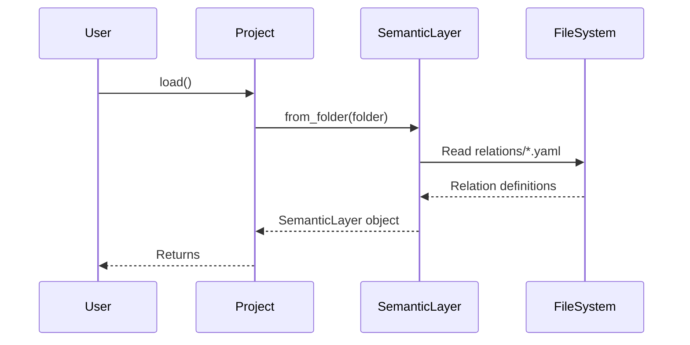

# Chapter 5: Relation

In the previous chapter, [Dimension](04_dimension_.md), we explored how to define attributes for grouping and filtering data. Now, let's delve into the very foundation upon which metrics and dimensions are built: the `Relation`.

Imagine you're building a house with Lego bricks. You can't build anything without having some bricks to start with! In `allstars`, a `Relation` is like a fundamental Lego brick – it represents a table or view in your database. It's your raw data source.

## Why do we need Relations?

Think of a spreadsheet. It has rows and columns, right? A `Relation` in `allstars` is like that spreadsheet, but for your database. It allows `allstars` to understand the structure of your data so it can generate efficient queries.

Let's say you have a table called `customers` with columns like `customer_id`, `name`, and `city`.  Without defining a `Relation` for the `customers` table, `allstars` wouldn't know these columns exist or what type of data they contain. Defining a `Relation` tells `allstars`, "Hey, I have a table called `customers` in my database, and it has these columns!"

## Key Concepts

Here's a breakdown of the key things that make up a `Relation`:

*   **Database Schema:** This is like the address of your table within your database. It tells `allstars` which part of the database to look in (e.g., `public`, `sales_data`).

*   **Reference:** This is the name of the table or view itself (e.g., `customers`, `orders`).

*   **Relation Type:** Tells us whether it's a `table` or a `view`.

*   **Columns:** A list of columns in the table or view, including their names and data types (e.g., `customer_id` is an integer, `name` is text).

*   **Key:** (Behind the scenes) A unique identifier that `allstars` uses to refer to this Relation. It is created using database schema and reference.

## Using Relations

Let's see how we can access `Relations` in `allstars`.  We'll assume we have a [Project](01_project_.md) loaded and its `semantic_layer` is accessible:

```python
from allstars.core.project import Project

# Load the project
project = Project(folder="my_project") # Replace with your actual folder
project.load()

# Access the semantic_layer
semantic_layer = project.semantic_layer
```

Now, let's say we want to get the `Relation` for a table named "customers" in the schema "public":

```python
# loop through the relations to find a match
customers_relation = None
for relation in semantic_layer.relations:
    if relation.database_schema == "public" and relation.reference == "customers":
        customers_relation = relation
        break

print(customers_relation)
```

Explanation:

1.  We iterate through all the `Relation` objects stored in the `semantic_layer.relations` collection.
2.  We check if the `database_schema` is "public" and the `reference` is "customers".
3.  If we find a match, we store it in the `customers_relation` variable.

Now, what if we want to see the columns in this relation?

```python
if customers_relation:
    for column in customers_relation.columns:
        print(f"Column Name: {column.name}, Data Type: {column.data_type}")
else:
    print("Relation 'public.customers' not found.")
```

Explanation:

1.  We first check if `customers_relation` is not `None`, to avoid errors.
2.  Then, if the relation is found, we loop through its columns and print the column's name and datatype.

## Under the Hood

When the [SemanticLayer](02_semanticlayer_.md) loads from files, it reads `Relation` definitions from YAML files.  Let's see how this happens.

Here's a simplified sequence diagram:



Explanation:

1.  The `User` calls `load()` on the `Project`.
2.  The `Project` calls `from_folder()` on the `SemanticLayer`.
3.  The `SemanticLayer` reads YAML files from the `relations` folder.
4.  The `FileSystem` returns the Relation definitions from the YAML files.
5.  The `SemanticLayer` creates a SemanticLayer object, which includes the loaded relations.
6.  The `Project` returns the `SemanticLayer` object to the `User`.

And here's a code snippet from `allstars/core/semantic_layer.py` that shows how the `SemanticLayer` loads relations:

```python
@classmethod
def from_folder(cls, folder_path=None):
    # Relations
    rel_folder = os.path.join(folder_path, "relations")
    yaml_files = glob.glob(f"{rel_folder}/*.yaml")
    relations = SerializableCollection()
    for file_path in yaml_files:
        relations.append(Relation.from_yaml_file(file_path))

    # ... (other loading logic) ...

    return cls(
        relations=relations,
        # ... (other attributes) ...,
    )
```

Explanation:

This code iterates through the YAML files in the "relations" folder and creates [Relation](05_relation_.md) objects from them. The `Relation.from_yaml_file` method is used to parse the YAML and create the `Relation` object. These `Relation` objects are then stored in the `relations` attribute of the [SemanticLayer](02_semanticlayer_.md).

## Conclusion

In this chapter, you learned about `Relations` and how they represent tables and views in your database. You saw how to access `Relations` and their columns from the [SemanticLayer](02_semanticlayer_.md). `Relations` are foundational to defining your data model within `allstars`.

Now that you understand `Relations`, let's move on to the next chapter and dive deeper into [Join](06_join_.md)!


---

Generated by [AI Codebase Knowledge Builder](https://github.com/The-Pocket/Tutorial-Codebase-Knowledge)