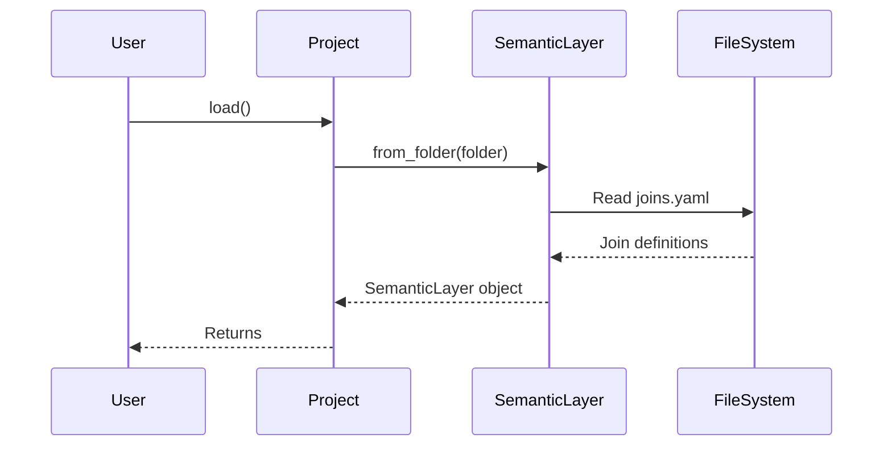

# Chapter 6: Join

In the previous chapter, [Relation](05_relation_.md), we learned how to define tables and views in our database as fundamental building blocks. But often, we need to combine data from *multiple* tables to get meaningful insights. That's where `Join` comes in!

Imagine you have two LEGO structures: one is a house, and another is a car. A `Join` is like a special connector that lets you combine the house and the car into a single, more complex structure.

In `allstars`, a `Join` defines how two [Relations](05_relation_.md) are connected. Think of it like the relationship between an "Orders" table and a "Customers" table. It specifies *how* to combine rows from these tables, like "Orders.customer_id = Customers.id". By defining `Joins`, you allow the system to combine data from multiple tables seamlessly, simplifying complex queries.

## Why do we need Joins?

Without `Joins`, you'd have to manually specify the connection logic in every query. This can get very complicated, especially when dealing with many tables!

Let's say you want to find the names of all customers who placed orders. Without a `Join`, you'd have to write a SQL query that knows exactly how the `Orders` and `Customers` tables are related.

With a `Join`, you define this relationship once, and then `allstars` can automatically combine the data whenever you need it. It makes your life much easier!

## Key Concepts

Here's a breakdown of the core ideas behind `Joins`:

*   **Left Relation Key:**  This is the [Relation](05_relation_.md)'s unique key for the "left" side of the join (e.g., the `Orders` table).
*   **Right Relation Key:** This is the [Relation](05_relation_.md)'s unique key for the "right" side of the join (e.g., the `Customers` table).
*   **Join Criteria:** This is the condition that specifies how the rows should be matched (e.g., `Orders.customer_id = Customers.id`). This is the most important part, as it dictates which rows are combined.
*   **Cardinality:** This describes the type of relationship between the tables (e.g., "many_to_one", "one_to_many", "many_to_many"). In the "Orders" and "Customers" example, it would most likely be "many_to_one" because many orders can belong to one customer.
*   **Join Term:** This specifies the type of SQL join to use (e.g., "JOIN", "LEFT JOIN", "RIGHT JOIN", "FULL OUTER JOIN"). This controls how unmatched rows are handled.

## Using Joins

Let's see how we can use `Joins` in `allstars`. Let's assume we have a [Project](01_project_.md) loaded and its `semantic_layer` is accessible:

```python
from allstars.core.project import Project

# Load the project
project = Project(folder="my_project") # Replace with your actual folder
project.load()

# Access the semantic_layer
semantic_layer = project.semantic_layer
```

Now, let's say we want to find a specific `Join` between the `orders` and `customers` tables. Let's assume that the left relation key is `public.orders` and the right relation key is `public.customers`.

```python
# loop through the joins to find a match
target_join = None
for join in semantic_layer.joins:
    if join.left_relation_key == "public.orders" and join.right_relation_key == "public.customers":
        target_join = join
        break

print(target_join)
```

Explanation:

1. We iterate through all the `Join` objects stored in the `semantic_layer.joins` collection.
2. We check if the `left_relation_key` and `right_relation_key` match our desired values.
3. If a match is found, it's stored in the `target_join` variable.

Now, let's say we want to see the join criteria:

```python
if target_join:
    print(target_join.join_criteria)
else:
    print("Join between 'public.orders' and 'public.customers' not found.")
```

Explanation:

1. We first check if `target_join` exists to avoid errors.
2.  We print the `join_criteria` of the found `Join`. For example, the output could be: `Orders.customer_id = Customers.id`.

## Under the Hood

When the [SemanticLayer](02_semanticlayer_.md) loads from files, it reads `Join` definitions from a YAML file. Let's see how this works.

Here's a simplified sequence diagram:



Explanation:

1.  The `User` calls `load()` on the `Project`.
2.  The `Project` calls `from_folder()` on the `SemanticLayer`.
3.  The `SemanticLayer` reads the `joins.yaml` file.
4.  The `FileSystem` returns the Join definitions.
5.  The `SemanticLayer` creates a SemanticLayer object, which includes the loaded joins.
6.  The `Project` returns the `SemanticLayer` object to the `User`.

And here's a code snippet from `allstars/core/semantic_layer.py` showing how the `SemanticLayer` loads joins:

```python
@classmethod
def from_folder(cls, folder_path=None):
    # ... (other loading logic) ...

    # Joins
    f = os.path.join(folder_path, "joins.yaml")
    joins = SerializableCollection.from_yaml_file(f, Join, key="joins")

    # ... (other loading logic) ...

    return cls(
        # ... (other attributes) ...,
        joins=joins,
        # ... (other attributes) ...
    )
```

Explanation:

This code shows the `from_folder` method reads the `joins.yaml` file, uses `SerializableCollection.from_yaml_file` to parse it, and stores the resulting `Join` objects in the `joins` attribute of the `SemanticLayer`.

## Conclusion

In this chapter, you learned about `Joins` and how they define relationships between [Relations](05_relation_.md). You saw how to retrieve `Joins` from the [SemanticLayer](02_semanticlayer_.md) and access their properties. `Joins` enable you to combine data from multiple tables easily, making complex queries simpler to manage.

Now that you understand `Joins`, let's move on to the next chapter and explore [Transpile](07_transpile_.md)!


---

Generated by [AI Codebase Knowledge Builder](https://github.com/The-Pocket/Tutorial-Codebase-Knowledge)