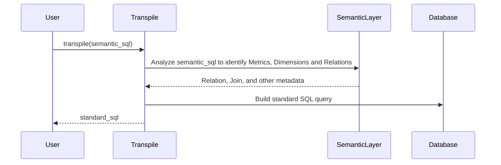

# Chapter 7: Transpile

In the previous chapter, [Join](06_join_.md), we learned how to define relationships between tables in our database. Now, let's see how we can use all of those definitions ([Relations](05_relation_.md), [Metrics](03_metric_.md), [Dimensions](04_dimension_.md), and [Joins](06_join_.md)) to actually query our data using a simplified language! This is where the `Transpile` module comes in.

Imagine you're asking a friend to get you something from the grocery store. You wouldn't tell them exactly which aisle to go to or which shelf to look on. You'd just say, "Get me some milk." The `Transpile` module is like that friend. You tell it what you want ("Total Sales by Region"), and it figures out the exact steps (the SQL query) to get it from the database.

The `Transpile` module takes a query written in a simplified "semantic layer" SQL and converts it into standard SQL that can be run against a database. It figures out things like which tables to join based on the relationships defined in the semantic layer. Think of it as a translator that bridges the gap between the high-level language of the semantic layer and the low-level language of the database.

## Why do we need the Transpile Module?

Without the `Transpile` module, you'd have to write complex SQL queries every time you wanted to get insights from your data, even when you've already defined all the relationships and metrics. This is tedious and error-prone.

Let's say you want "Total Sales by Region". You would ideally just write some simple semantic SQL like:

`SELECT TotalSales, Region FROM Super`

Instead, if you had to write raw SQL, you'd need to remember which tables contain sales data, which tables contain region data, how to join them, and how to calculate the total sales. The `Transpile` module lets you write the simple query above, and then converts it into something like this:

```sql
SELECT SUM(orders.amount), customers.region
FROM orders
JOIN customers ON orders.customer_id = customers.id
GROUP BY customers.region;
```

The `Transpile` module automates all the hard parts!

## Key Concepts

Let's break down the core concepts behind the `Transpile` module:

*   **Semantic SQL:** This is a simplified SQL-like language that you use to query your data. It's designed to be easy to read and write, and it focuses on the business concepts you care about (like "Total Sales" and "Region"). The goal is that it should be simple.
*   **Translation:** The `Transpile` module takes your semantic SQL query and translates it into standard SQL that your database can understand.
*   **Metadata Awareness:** The `Transpile` module understands the relationships between your tables (defined in your [SemanticLayer](02_semanticlayer_.md)) and automatically generates the necessary `JOIN` clauses.
*   **SQL Generation:** The final standard SQL is generated in a database-specific dialect to ensure correct execution.

## Using the Transpile Module

Let's see how we can use the `Transpile` module in `allstars`.  We won't be loading a Project here because we will focus on the `transpile` function directly to illustrate it.

```python
from allstars.sql.transpile import transpile
from sqlalchemy import create_engine

# Create an in-memory SQLite engine for demonstration
engine = create_engine('sqlite:///:memory:')

# Your semantic SQL query
semantic_sql = "SELECT TotalSales, Region FROM Super"

# Transpile the semantic SQL to standard SQL
standard_sql = transpile(engine, semantic_sql)

# Print the transpiled SQL
print(standard_sql)
```

Explanation:

1.  We import the `transpile` function from `allstars.sql.transpile`.
2.  For this example, we are using in-memory SQLite. *Replace this with your database connection.*
3.  We define our semantic SQL query.  In a real-world scenario, you would likely be getting this query from a user interface or some other source. The `Super` table name isn't important - it's just a placeholder to trigger the logic.
4.  We call the `transpile` function, passing in our semantic SQL query. The function will return the equivalent standard SQL query. *It is important to pass in the engine object*.
5.  We print the resulting SQL query.  The output will look something like the SQL example mentioned earlier. You could then execute this query against your database.

## Under the Hood

Let's take a peek under the hood to see how the `Transpile` module works.

Here's a simplified sequence diagram illustrating the process:



Explanation:

1.  The `User` calls the `transpile()` function, providing a semantic SQL query.
2.  The `Transpile` module analyzes the semantic SQL, extracting the required [Metrics](03_metric_.md), [Dimensions](04_dimension_.md), and [Relations](05_relation_.md).
3.  The `Transpile` module uses the semantic layer to get the necessary metadata (table relationships, metric expressions, etc).
4.  The `Transpile` module then constructs the standard SQL query based on this metadata.
5.  The `Transpile` module returns the generated SQL query to the user.

Here's a simplified snippet from `allstars/sql/transpile.py` showing the `transpile` function:

```python
from sqlglot import parse, parse_one
from sqlglot.dialects.dialect import Dialect

def transpile(engine, query: str) -> str:
    """
    Transpile a semantic layer query.
    """
    tree = parse(query)

    # ... (Logic to analyze tables, columns, and joins) ...

    query = ";\n".join(
        Dialect.get_or_raise("sqlite")().generate(statement) for statement in statements
    )
    return query
```

Explanation:

This code shows that the `transpile` function:

1.  Parses the semantic SQL query into an abstract syntax tree (AST) using `sqlglot`.
2.  Analyzes the AST to identify the tables, columns, and joins required.
3.  Constructs a standard SQL query based on the metadata from the `SemanticLayer`.
4.  Uses `sqlglot` to generate a database-specific SQL query from the constructed AST.

## Conclusion

In this chapter, you learned about the `Transpile` module and how it translates semantic SQL queries into standard SQL queries. This allows you to write simpler queries that focus on the business concepts you care about, while the `Transpile` module handles the complexity of generating the correct SQL for your database.

Now that you understand the `Transpile` module, let's move on to the next chapter and explore how `allstars` interacts with [DatabaseInterface](08_databaseinterface_.md)!


---

Generated by [AI Codebase Knowledge Builder](https://github.com/The-Pocket/Tutorial-Codebase-Knowledge)