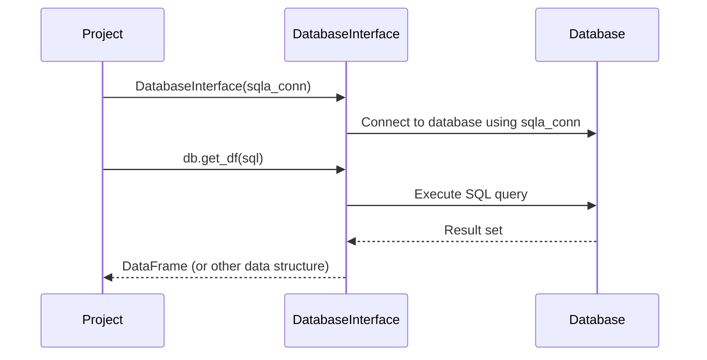

# Chapter 8: DatabaseInterface

In the previous chapter, [Transpile](07_transpile_.md), we learned how to convert our simplified queries into standard SQL. But how does `allstars` *actually* connect to your database and run those queries? That's where the `DatabaseInterface` comes in.

Imagine you have a phone (your `allstars` application) and you want to call a friend (your database). You need a phone line or a cell signal to connect the two. The `DatabaseInterface` is that phone line – it provides a way for `allstars` to talk to your database.

## Why do we need a DatabaseInterface?

Different databases (like PostgreSQL, MySQL, SQLite) all speak slightly different "languages" (SQL dialects) and have different ways of connecting. Without a `DatabaseInterface`, `allstars` would need to know the specifics of *every* database. This would make `allstars` very complex and hard to maintain.

The `DatabaseInterface` solves this problem by providing a consistent way to connect to *any* SQL database. Think of it like a universal adapter that can plug into any database socket.

Let's say you want to get the `TotalSales` from your database. The `DatabaseInterface` handles the messy details of connecting to your specific database (whether it's PostgreSQL, MySQL, or something else), sending the SQL query, and getting the data back. You just tell it *what* you want, and it takes care of the *how*.

## Key Concepts

Let's break down the core concepts behind the `DatabaseInterface`:

*   **Connection Management:** The `DatabaseInterface` manages the connection to your database. This includes opening the connection, keeping it alive, and closing it when finished. It's like making sure the phone line is always open and ready to use.
*   **SQL Execution:** It executes SQL queries against your database. It's like sending your voice down the phone line to your friend.
*   **Data Retrieval:** It retrieves the results of your SQL queries. It's like hearing your friend's response on the other end of the phone.
*   **Abstraction:** It hides the specifics of the underlying database. You don't need to know the exact details of how to connect to PostgreSQL or MySQL. The `DatabaseInterface` handles that for you.

## Using the DatabaseInterface

Let's see how we can use the `DatabaseInterface` in `allstars`. Remember in the [Project](01_project_.md) chapter, we created the `Project` instance with the `sqla_conn`? That's where the `DatabaseInterface` comes into play.

```python
from allstars.core.project import Project

# Load the project
project = Project(folder="my_project") # Replace with your actual folder
project.load()

# Access the DatabaseInterface
db = project.db
```

Explanation:

1.  We load our [Project](01_project_.md) (just like in previous chapters). The `Project` is responsible for initializing the `DatabaseInterface`.
2.  We access the `db` attribute of the `project` object. This gives us access to the `DatabaseInterface` that's connected to our database.

Now, let's say we want to run a simple SQL query:

```python
sql = "SELECT * FROM customers LIMIT 10"
# db.get_df(sql) # skipped to avoid external dependencies.
```

Explanation:
1.  `db.get_df(sql)` is used to get a dataframe from the SQL query. However, we skip its actual execution here as `allstars` does not enforce having `pandas` installed.

## Under the Hood

Let's take a peek under the hood to see how the `DatabaseInterface` connects to your database and executes queries.

Here's a simplified sequence diagram illustrating the process:



Explanation:

1.  The `Project` creates a `DatabaseInterface` object, passing in the database connection string (`sqla_conn`).
2.  The `DatabaseInterface` uses the `sqla_conn` string to connect to the database.
3.  The `Project` calls the `get_df()` method on the `DatabaseInterface`, passing in the SQL query.
4.  The `DatabaseInterface` executes the SQL query against the database.
5.  The database returns the result set to the `DatabaseInterface`.
6.  The `DatabaseInterface` converts the result set into a Pandas DataFrame (or other data structure) and returns it to the `Project`.

And here's a snippet from `allstars/core/project.py` showing how the `DatabaseInterface` is initialized:

```python
from allstars.database_interface import DatabaseInterface


class Project:
    def __init__(self, folder=None, sqla_conn=None, *args, **kwargs):
        # ... (other initialization logic) ...

        self.db = DatabaseInterface(self.sqla_conn) # sqla_conn is important
```

Explanation:

This code shows that the `DatabaseInterface` is created within the `Project`'s `__init__` method. It takes the database connection string (`sqla_conn`) as input. The connection string is like a URL for your database, specifying the database type, hostname, username, password, and database name.

## Conclusion

In this chapter, you learned about the `DatabaseInterface` and how it provides a consistent way for `allstars` to connect to and interact with your SQL database. You saw how to access the `DatabaseInterface` from a [Project](01_project_.md) and how it handles SQL execution and data retrieval. The `DatabaseInterface` abstracts away the complexities of database connectivity, making it easier to work with your data in `allstars`.

Congratulations! You've now completed all the core concept chapters of this tutorial. From here, you can explore more advanced topics and start building your own `allstars` projects!


---

Generated by [AI Codebase Knowledge Builder](https://github.com/The-Pocket/Tutorial-Codebase-Knowledge)