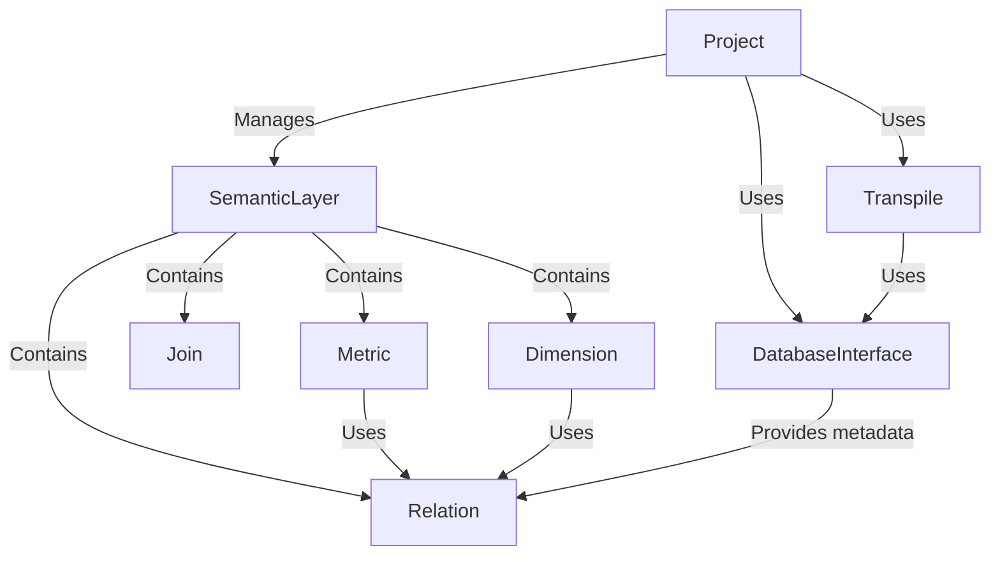

# Tutorial: allstars

AllStars helps you analyze data by providing a **Semantic Layer** that sits between your data and your queries. It defines *Metrics*, *Dimensions*, and *Relations* so you can ask questions in a simplified language. The system then *Transpiles* these requests into SQL that your *DatabaseInterface* can understand and execute.

**Source Repository:** [https://github.com/preset-io/allstars.git](https://github.com/preset-io/allstars.git)

## Chapters

1. [Project
](01_project_.md)
2. [SemanticLayer
](02_semanticlayer_.md)
3. [Metric
](03_metric_.md)
4. [Dimension
](04_dimension_.md)
5. [Relation
](05_relation_.md)
6. [Join
](06_join_.md)
7. [Transpile
](07_transpile_.md)
8. [DatabaseInterface
](08_databaseinterface_.md)

---

Generated by [AI Codebase Knowledge Builder](https://github.com/The-Pocket/Tutorial-Codebase-Knowledge)